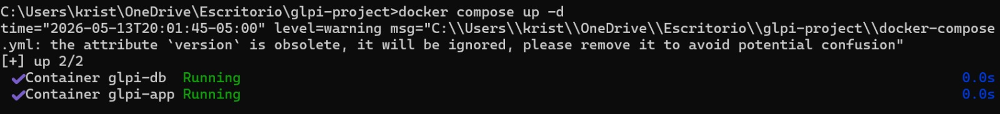
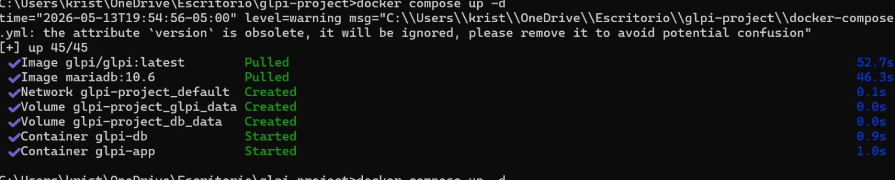
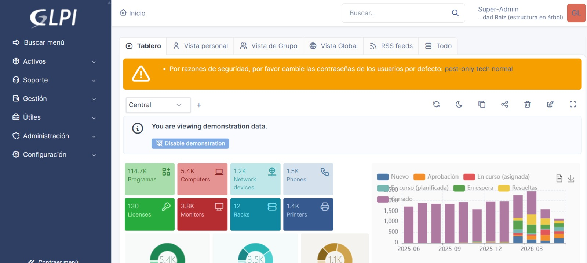

# GLPI Docker

Proyecto de implementación de GLPI utilizando Docker y MariaDB, permitiendo un despliegue rápido, organizado y con persistencia de datos mediante contenedores.

---

# Tecnologías utilizadas

- Docker
- Docker Compose
- MariaDB
- GLPI

---

# Estructura

```plaintext
glpi-docker/
│
├── docker-compose.yml
├── .env.example
├── README.md
├── .gitignore
│
├── config/
│   └── php.ini
│
├── volumes/
│   ├── glpi/
│   └── mariadb/
│
├── backups/
│   └── README.md
│
└── informacion/
    └── imagenes/
        ├── container.jpeg
        ├── glpi-login.png
        └── installation-process.png
```

- Contenedor GLPI
- Contenedor MariaDB



- Persistencia mediante volúmenes
- Variables de entorno para seguridad

---

# Instalación

## Ingresar al proyecto

```bash
cd glpi-docker
```

---

## Configurar variables de entorno

Configurar el archivo `.env` basado en `.env.example`.

Ejemplo:

```env
MYSQL_ROOT_PASSWORD=root123
MYSQL_DATABASE=glpidb
MYSQL_USER=glpi
MYSQL_PASSWORD=glpi123
```

---

# Configuración Docker Compose

```yaml
services:

  glpi-db:
    image: mariadb:10.6
    container_name: glpi-db
    restart: always

    environment:
      MYSQL_ROOT_PASSWORD: root123
      MYSQL_DATABASE: glpidb
      MYSQL_USER: glpi
      MYSQL_PASSWORD: glpi123

    volumes:
      - glpi-db-data:/var/lib/mysql

  glpi-app:
    image: diouxx/glpi
    container_name: glpi-app
    restart: always

    ports:
      - "8080:80"

    depends_on:
      - glpi-db

    volumes:
      - glpi-data:/var/www/html/glpi

volumes:
  glpi-db-data:
  glpi-data:
```

---

# Ejecución

```bash
docker compose up -d
```

---

# Verificar contenedores

```bash
docker ps
```

Resultado esperado:

```plaintext
glpi-db     Running
glpi-app    Running
```

---

# Acceso

```plaintext
http://localhost:8080
```

---

# Configuración de la base de datos

Durante la instalación de GLPI utilizar:

| Parámetro | Valor |
|---|---|
| Servidor | glpi-db |
| Usuario | glpi |
| Contraseña | glpi123 |
| Base de datos | glpidb |

---

# Credenciales por defecto

| Usuario | Contraseña |
|---|---|
| glpi | glpi |
| tech | tech |
| normal | normal |
| post-only | postonly |

---
# Intefas


# Comandos útiles

## Detener contenedores

```bash
docker compose down
```

---

## Reiniciar contenedores

```bash
docker compose restart
```

---

## Ver logs

```bash
docker compose logs -f
```

---

## Eliminar contenedores y volúmenes

```bash
docker compose down -v
```

---

# Archivo .gitignore

```gitignore
.env
volumes/
backups/
*.log
```

---

# Persistencia de datos

El proyecto utiliza volúmenes Docker para conservar:

- Información de GLPI
- Base de datos MariaDB
- Configuraciones del sistema

---

# Seguridad recomendada

- Cambiar contraseñas por defecto
- No exponer MariaDB públicamente
- Utilizar variables de entorno
- Realizar copias de seguridad periódicas
- Mantener Docker y GLPI actualizados

---

# Autores

- Jimmy Lucas
- Cristian Sanchez
- Juan Rodriguez
- Daniel Gomez
## link
https://hub.docker.com/r/kris28sanchez/glpi
